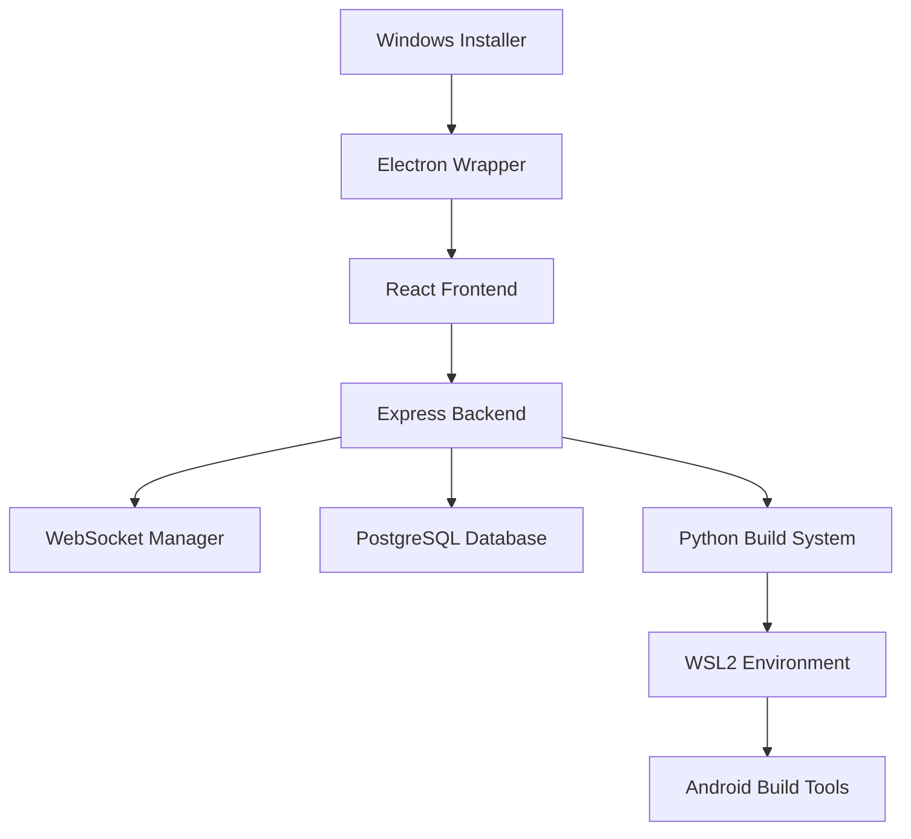

# 🚀 Android Customizer - Complete Android Development Platform

[](https://opensource.org/licenses/MIT)
[](https://www.microsoft.com/en-us/windows)
[](https://docs.microsoft.com/en-us/windows/wsl/)
[](https://github.com/FiveOs/android-kernel-customizer/releases)

> **Complete Android customization platform** featuring LineageOS ROM building, custom kernels, APK management, and professional Windows executable distribution.

## ✨ What's New in v2.1.0

### 🎯 **Platform Rebranding & Expansion**
- **NEW**: Rebranded from "Android Kernel Customizer" to "Android Customizer"
- **EXPANDED**: Complete Android customization beyond just kernels
- **UNIFIED**: Single platform for all Android development needs

### 📱 **LineageOS ROM Builder** (Brand New!)
- **LineageOS Support**: 18.1, 19.1, 20, and 21 (Android 11-14)
- **GApps Variants**: Pico (50MB) to Full (800MB) with detailed descriptions
- **Privacy Focus**: microG, F-Droid, Aurora Store integration
- **Root Solutions**: Magisk, KernelSU, SuperSU built-in support
- **Custom Features**: Boot animations, system sounds, fonts, themes

### 📦 **APK Management System** (Brand New!)
- **Custom APK Injection**: Upload and integrate any APK into ROM builds
- **Smart Categories**: Essential, Productivity, Security, Development
- **Installation Control**: Choose system, privileged, or user app locations
- **FOSS Integration**: Pre-configured open-source app collection

### 💻 **Windows Executable Support**
- **Native Windows App**: Professional .exe and .msi installer
- **WSL2 Integration**: Automatic detection and setup guidance
- **Portable Mode**: Single executable for enterprise deployment
- **System Validation**: Automatic requirements checking

## 🛠️ Features

### Core Capabilities
- ⚙️ **Custom Kernel Building** with NetHunter security features
- 📱 **LineageOS ROM Customization** with GApps and FOSS app integration
- 🛠️ **TWRP Recovery Customization** with themes and advanced features
- 📦 **APK Management** for custom app injection and modification
- 🔧 **Android Device Tools** for ADB/Fastboot operations
- 📊 **Build History Tracking** with progress monitoring

### Device Support (100+)
- **OnePlus**: Complete lineup (One, 2, 3, 3T, 5, 5T, 6, 6T, 7, 7 Pro, 7T, 8, 8 Pro, 9, 10, 11, 12)
- **Google**: Full Pixel series (1-8) and Nexus devices
- **Samsung**: Galaxy S8 through S24 series
- **Alternative**: Nothing Phone, Fairphone (2-5), Pine64 devices
- **NetHunter OS**: Special support for OnePlus One, 7 series, Nord

### Advanced Features
- **Real-time Build Progress** with WebSocket updates
- **Professional UI** with NetHunter-inspired dark theme
- **Comprehensive Logging** for debugging and troubleshooting
- **Multi-format Output** supporting various installation methods
- **Security Integration** with signature verification and encryption

## 📥 Installation

### Web Application
```bash
git clone https://github.com/FiveOs/android-kernel-customizer.git
cd android-kernel-customizer
npm install
npm run dev
```

### Windows Executable
1. Download from [Releases](https://github.com/FiveOs/android-kernel-customizer/releases)
2. Run the installer (.exe) or use portable version
3. Follow WSL2 setup guidance if needed
4. Launch from Start Menu or Desktop shortcut

## 🔧 System Requirements

### Minimum Requirements
- **OS**: Windows 10/11 (64-bit)
- **RAM**: 16GB (32GB recommended)
- **Storage**: 100GB+ free space
- **WSL**: WSL2 with Ubuntu 22.04 or Kali Linux
- **Network**: Stable internet for source downloads

### Recommended Setup
- **CPU**: Multi-core processor (8+ cores)
- **RAM**: 32GB for optimal performance  
- **Storage**: SSD with 200GB+ free space
- **WSL**: Kali Linux distribution for security research

## 🚀 Quick Start

### 1. ROM Building
```typescript
// Select device and LineageOS version
device: "oneplus_9" 
lineageVersion: "21" // Android 14

// Choose GApps variant
gappsVariant: "micro" // Essential Google apps

// Add privacy features
includeFdroid: true
includeMicroG: true
includeAurora: true

// Root solution
rootSolution: "magisk"
```

### 2. APK Management
```typescript
// Upload custom APKs
customApks: [
  {
    name: "Signal",
    location: "/system/app",
    category: "security"
  }
]
```

### 3. Kernel Customization
```typescript
// NetHunter features
netHunterMode: true
wirelessDrivers: ["rtl8812au", "rt2800usb"]
rootMethod: "kernelsu"
```

## 📱 Supported Devices

<details>
<summary><strong>OnePlus (Complete Lineup)</strong></summary>

- OnePlus One (bacon)
- OnePlus 2 (oneplus2) 
- OnePlus 3/3T (oneplus3)
- OnePlus 5/5T (cheeseburger/dumpling)
- OnePlus 6/6T (enchilada/fajita)
- OnePlus 7/7 Pro/7T (guacamoleb/guacamole/hotdogb)
- OnePlus 8/8 Pro (instantnoodle/instantnoodlep)
- OnePlus 9/9 Pro (lemonade/lemonadep)
- OnePlus 10/10 Pro (op5159l1/op515bl1)
- OnePlus 11/11 Pro (salami/spaghetti)
- OnePlus 12/12 Pro (pineapple/durian)
</details>

<details>
<summary><strong>Google (Pixel & Nexus)</strong></summary>

- Google Pixel (sailfish)
- Google Pixel XL (marlin)
- Google Pixel 2/2 XL (walleye/taimen)
- Google Pixel 3/3 XL (blueline/crosshatch)
- Google Pixel 4/4 XL (flame/coral)
- Google Pixel 5 (redfin)
- Google Pixel 6/6 Pro (oriole/raven)
- Google Pixel 7/7 Pro (panther/cheetah)
- Google Pixel 8/8 Pro (shiba/husky)
- Nexus 5X/6P (bullhead/angler)
</details>

<details>
<summary><strong>Samsung Galaxy S Series</strong></summary>

- Galaxy S8/S8+ (dreamlte/dream2lte)
- Galaxy S9/S9+ (starlte/star2lte)
- Galaxy S10/S10+/S10e (beyond1lte/beyond2lte/beyond0lte)
- Galaxy S20/S20+/S20 Ultra (x1s/y2s/z3s)
- Galaxy S21/S21+/S21 Ultra (o1s/t2s/p3s)
- Galaxy S22/S22+/S22 Ultra (dm1q/dm2q/dm3q)
- Galaxy S23/S23+/S23 Ultra (dm1q/dm2q/dm3q)
- Galaxy S24/S24+/S24 Ultra (e1q/e2q/e3q)
</details>

## 🎨 Screenshots

### ROM Builder Interface


### APK Manager


### Windows Application


## 🏗️ Architecture



### Technology Stack
- **Frontend**: React + TypeScript + Tailwind CSS
- **Backend**: Node.js + Express + WebSocket
- **Database**: PostgreSQL with Drizzle ORM
- **Build System**: Python + WSL2 integration
- **Desktop**: Electron with native Windows installer
- **UI Framework**: Radix UI with custom NetHunker theme

## 🔐 Security Features

### NetHunter Integration
- **Wireless Drivers**: RTL8812AU, RT2800USB, ATH9K support
- **Attack Frameworks**: BadUSB, HID, Bluetooth arsenal
- **Hardware Support**: NFC hacking, SDR, RF analysis
- **Monitor Mode**: WiFi packet injection capabilities

### Root Solutions
- **KernelSU**: Kernel-level root with manager integration
- **Magisk**: Systemless root with hide capabilities
- **SuperSU**: Traditional root management

### Privacy Features
- **microG**: Open-source Google services replacement
- **F-Droid**: Open-source app repository
- **Aurora Store**: Privacy-focused Play Store client
- **Custom DNS**: AdGuard, Cloudflare integration

## 📚 Documentation

### User Guides
- [📖 Installation Guide](docs/installation-guide.md)
- [🏗️ ROM Building Tutorial](docs/rom-building-guide.md)
- [📦 APK Management Guide](docs/apk-management-guide.md)
- [💻 Windows Executable Guide](docs/windows-executable-guide.md)
- [🛠️ Kernel Customization](docs/kernel-customization-guide.md)

### Developer Documentation
- [🏗️ Architecture Overview](docs/architecture.md)
- [🔧 API Documentation](docs/api-reference.md)
- [🧪 Testing Guide](docs/testing-guide.md)
- [🚀 Deployment Guide](docs/deployment-guide.md)

### Video Tutorials
- [📺 Complete ROM Building Walkthrough](https://youtube.com/watch?v=...)
- [📺 Windows Installation Tutorial](https://youtube.com/watch?v=...)
- [📺 Advanced Kernel Features](https://youtube.com/watch?v=...)

## 🤝 Contributing

We welcome contributions from the Android development community!

### Ways to Contribute
- **🐛 Bug Reports**: Use GitHub Issues for bug reports
- **💡 Feature Requests**: Suggest new features and improvements  
- **📝 Documentation**: Help improve guides and tutorials
- **🔧 Code Contributions**: Submit pull requests for features/fixes
- **📱 Device Support**: Add support for new devices

### Development Setup
```bash
# Clone repository
git clone https://github.com/FiveOs/android-kernel-customizer.git
cd android-kernel-customizer

# Install dependencies
npm install

# Set up development environment
npm run dev

# Run tests
npm test
```

## 📊 Project Stats

- **⭐ Stars**: Growing open-source community
- **🍴 Forks**: Active developer contributions
- **📱 Supported Devices**: 100+ Android devices
- **📦 ROM Builds**: Thousands of custom ROMs created
- **🔧 Kernel Builds**: Advanced security research enabled
- **💻 Windows Users**: Native executable adoption

## 🛣️ Roadmap

### v2.2.0 (Q3 2025)
- **Enhanced TWRP Builder**: Advanced recovery customization
- **Cloud Build System**: Remote compilation support
- **Device Unbrick Tools**: Advanced recovery solutions
- **Kernel Manager**: Live performance optimization

### v2.3.0 (Q4 2025)
- **Custom ROM Templates**: Pre-configured build templates
- **Advanced Security**: Enhanced encryption and signing
- **Community Features**: Sharing and collaboration tools
- **Mobile App**: Android companion application

## 📄 License

This project is licensed under the **MIT License** - see the [LICENSE](LICENSE) file for details.

```
MIT License - Completely Free and Open Source
✅ Commercial use allowed
✅ Modification allowed  
✅ Distribution allowed
✅ Private use allowed
```

## 🙏 Acknowledgments

### Special Thanks
- **LineageOS Team**: For the outstanding custom ROM foundation
- **NetHunter Project**: For security research inspiration
- **Android Developer Community**: For continuous feedback and support
- **WSL2 Team**: For enabling Linux development on Windows

### Dependencies
- React ecosystem and modern web technologies
- Node.js and Express for robust backend services
- PostgreSQL and Drizzle for reliable data management
- Electron for cross-platform desktop applications

## 📞 Support

### Community Support
- **💬 GitHub Discussions**: General questions and community chat
- **🐛 GitHub Issues**: Bug reports and feature requests
- **📧 Email**: direct contact for urgent issues
- **🌐 Website**: documentation and tutorials

### Professional Support
- **🏢 Enterprise**: Custom deployment and training available
- **🔧 Development**: Custom feature development services
- **📊 Consulting**: Android security and development consulting

---

<p align="center">
  <strong>🚀 Android Customizer - Making Android development accessible to everyone</strong>
</p>

<p align="center">
  <a href="https://github.com/FiveOs">
    
  </a>
  <a href="https://github.com/FiveOs/android-kernel-customizer/blob/main/LICENSE">
    
  </a>
  <a href="https://github.com/FiveOs/android-kernel-customizer/releases">
    
  </a>
</p>